# 从词性开始

让我们先来认识一下 句子 和 句子 的成分，

主谓宾句型 -> I hit you.

句子的成分可以拆解为，

I -> 主

hit -> 谓

you. -> 宾

那每一个句子成分的词性是什么呢？

今天我们来说说十大词性。

句子， 句子成分， 词性

他们仨之间到底有啥不可见人的关系呢？

单词相对于句子成分就像是，

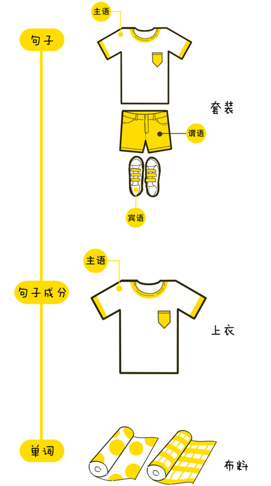

单词是句子成分最小的单位，而每一个单词都有词性。

那十大词性，又是啥玩意呢？

我们把他们拆成了3类

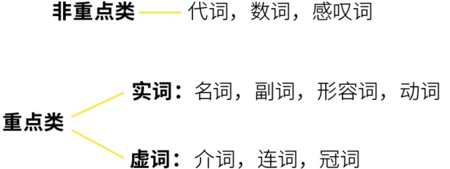

我们先来看看非重点类的词性。

>根据英文定义，
>
> pronoun = pro（代替） + noun（名词）
>
> 代名词的词。

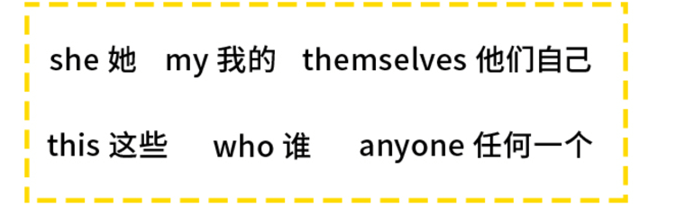

这些都是指代某个名词的词。

数词 嘛，顾名思义「1，2，3，4，5」

就是跟数字有关的单词。

这个应该是最好理解的了，就是表示说话感情的词语。

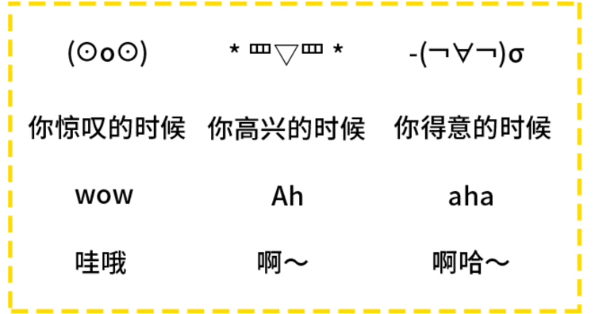

***以上就是一些非重点的词性，接下来就是一些重点词性了。***

名词：名称的词性。

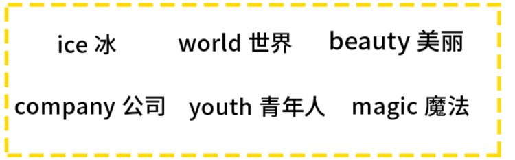

**是表示具体或者抽象事物/人物的词。**

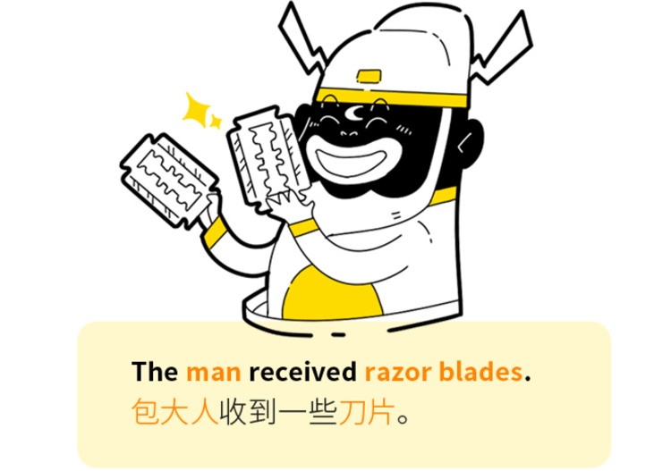

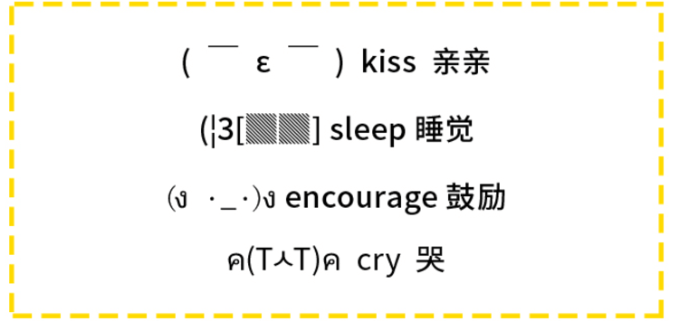

**动词是表示动作或者状态的词。**

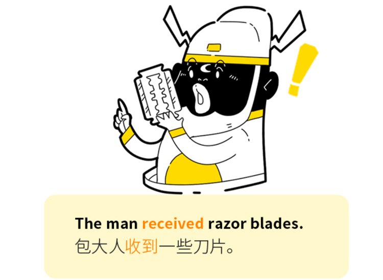

形容词：形容名词的词。

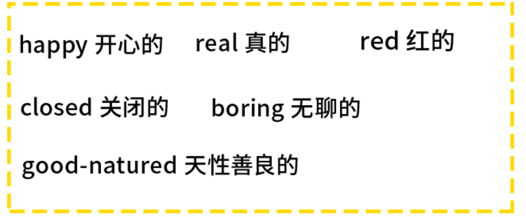

**对名词有修饰限定的作用**

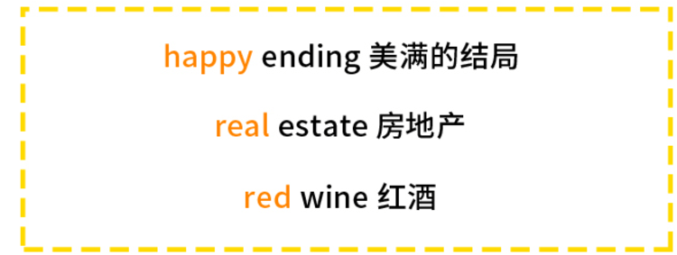

通常交代时间，地点，原因，程度等非核心信息。

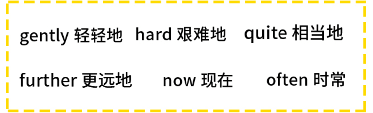

他可以修饰形容词，动词，副词以及句子。

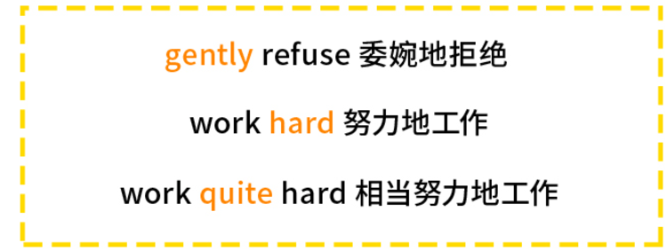

这四个实词还有几段狗血的关系。大致可以表现为，

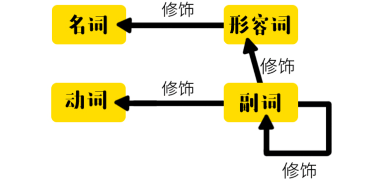

但是一个句子光有实词就太简单了，语法才不会这么简单呢！不信就去看看`Rust`。所以又出现了三大虚词来折磨我们。

它可以和世界上顶级的科技公司一起出现，起限定作用。

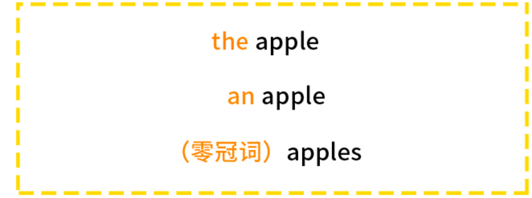

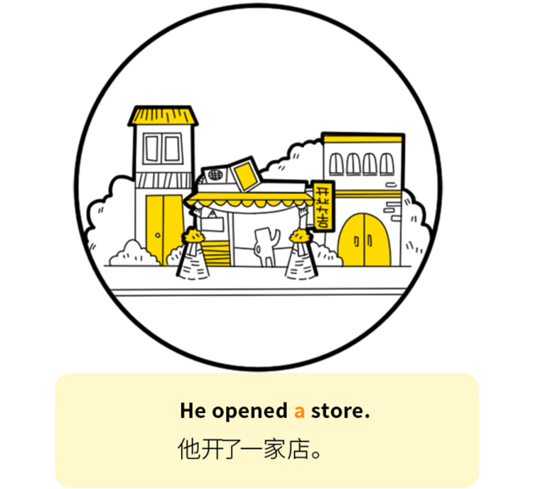

这是最难的介词。

他出现在 名词 的前面，表示名词于其他词之间的关系。

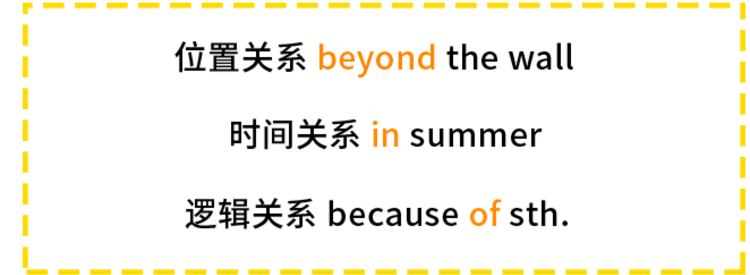

连词就是连接两个词语或者句子的词语，

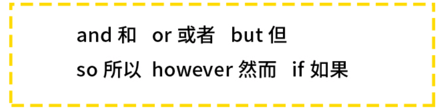

可以连接两个单词，

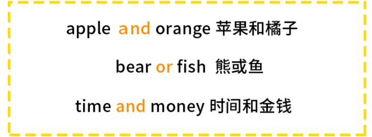

也可以连接两个句子。

所谓的 虚词 ，于 实词 恰恰相反，也就是不能单独作为句子成分的单词，他们需要跟实词一起才组成了句子成分。

冠词 需要在 名词 前面；
介词 也需要和 名词 配合；
连词 同样也需要连接词语，短语或者句子。

而然句子成分都有比较固定的词性所以我们可以得出一张表。

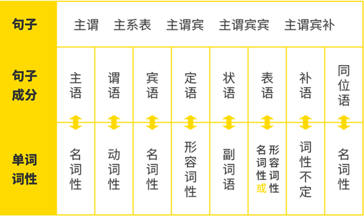

虽然不敢保证完全相等，但是这样有助于理解语法体系的建立。

