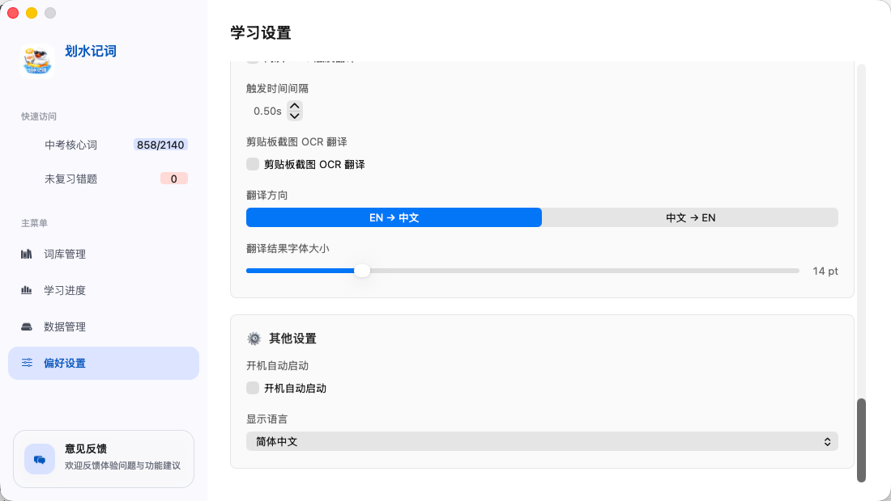
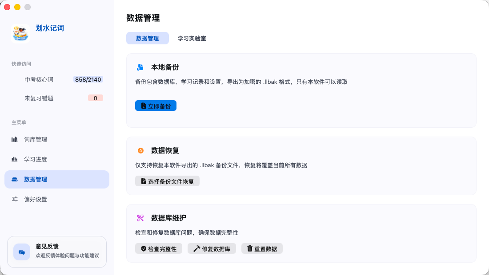
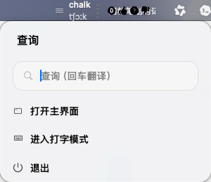
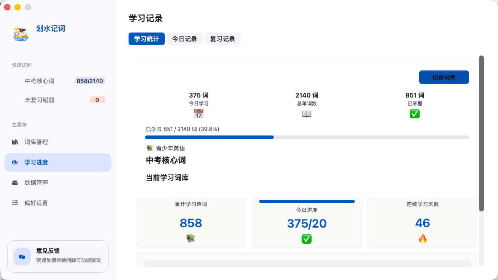

# 划水记词（LearnLanguage）

一款面向 macOS 的桌面端背词与划词翻译工具。它把词库管理、学习进度、状态栏快捷查询、OCR 翻译、打字练习和本地数据备份整合在一起，适合在日常阅读、写作和学习中轻量使用。

> 项目当前主要面向中文用户，应用显示语言以简体中文为主。

## 预览

<p align="center">
  
  
</p>

<p align="center">
  
  
</p>

## 功能特性

- 词库管理：内置词库数据，支持按词库组织和学习单词。
- 学习进度：统计已学、今日学习、复习记录和连续学习天数。
- 状态栏工具：从 macOS 菜单栏快速查询单词、进入主界面或打开打字模式。
- 划词/剪贴板翻译：监听复制内容并进行快捷翻译。
- OCR 翻译：支持对剪贴板截图进行 OCR 识别与翻译。
- 发音支持：支持本地 TTS 和有道发音源，可切换美式/英式口音。
- 打字练习：以浮窗形式进行单词打字训练，配合键盘音效提升练习反馈。
- 学习设置：支持每日目标、触发间隔、翻译方向、结果字号等配置。
- 数据管理：支持本地备份、恢复、数据库完整性检查与维护。
- 多语言学习预留：代码层面预留英语、日语、韩语学习语言扩展。

## 技术栈

- Swift / AppKit
- CocoaPods
- SnapKit：界面布局
- WCDB.swift / SQLiteRepairKit：数据库与修复能力
- MMKV：轻量键值存储
- HotKey：全局快捷键
- Alamofire / Moya：网络请求
- lottie-ios：动画
- DGCharts：学习数据可视化

## 环境要求

- macOS 12.0+
- Xcode 15 或更高版本（建议）
- CocoaPods

## 快速开始

1. 克隆项目：

```bash
git clone <your-repo-url>
cd LearnLanguage
```

2. 安装依赖：

```bash
pod install
```

3. 打开工作区：

```bash
open LearnLanguage.xcworkspace
```

4. 在 Xcode 中选择 `LearnLanguage` Scheme，点击运行。

> 注意：项目使用 CocoaPods 管理依赖，请打开 `LearnLanguage.xcworkspace`，不要直接打开 `LearnLanguage.xcodeproj`。

## 项目结构

```text
LearnLanguage/
├── LearnLanguage/                 # 应用源码
│   ├── Base/                      # 基础设施、模型、存储、工具类
│   ├── Common/                    # 通用扩展
│   ├── Modules/                   # 功能模块
│   │   ├── Data/                  # 数据管理
│   │   ├── GrammarNotes/          # 语法笔记资源
│   │   ├── Main/                  # 主界面
│   │   ├── Progress/              # 学习进度
│   │   ├── Settings/              # 偏好设置
│   │   ├── StatusBar/             # 菜单栏与弹窗
│   │   ├── Translation/           # 翻译、OCR、剪贴板监听
│   │   ├── TypingPractice/        # 打字练习
│   │   └── WordList/              # 词库与单词列表
│   └── Resources/                 # 字体、音效、词库、图片、本地化资源
├── LearnLanguage.xcworkspace      # Xcode 工作区
├── LearnLanguage.xcodeproj        # Xcode 项目
├── Podfile                        # CocoaPods 依赖配置
└── README.md
```

## 数据与隐私

应用数据默认保存在本机，学习记录、设置和词库数据可通过“数据管理”进行本地备份和恢复。备份文件使用应用自定义的 `.llbak` 格式，仅本软件可读取。

## 开源说明

如果你准备正式开源，建议在发布前检查以下内容：

- 是否需要移除或精简 `Pods/` 目录，通常开源项目只提交 `Podfile` 和 `Podfile.lock`。
- 是否包含第三方词库、音效、字体、图片等资源，并确认它们的授权允许再分发。
- 是否包含接口密钥、个人路径、测试数据或其他敏感信息。
- 补充合适的开源协议，例如 MIT、Apache-2.0 或 GPL。

## 许可证

当前尚未指定许可证。正式开源前请在仓库中添加 `LICENSE` 文件。
